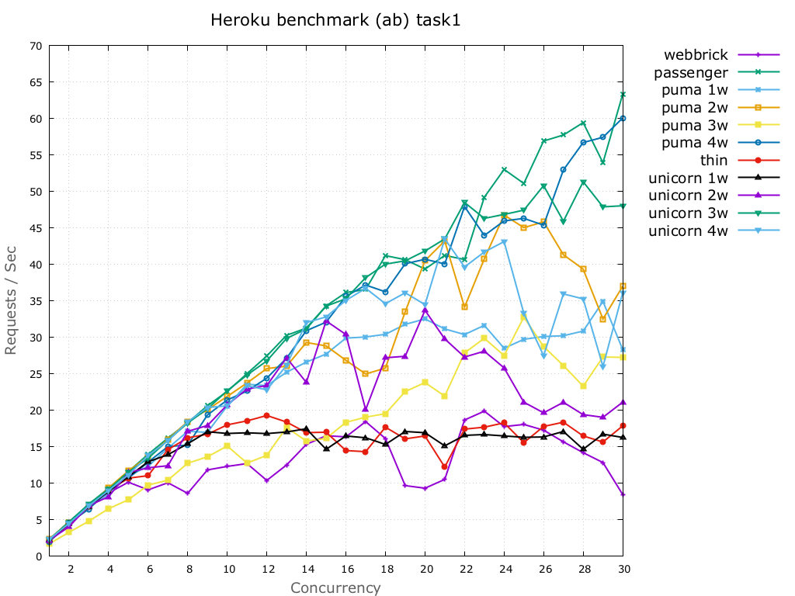
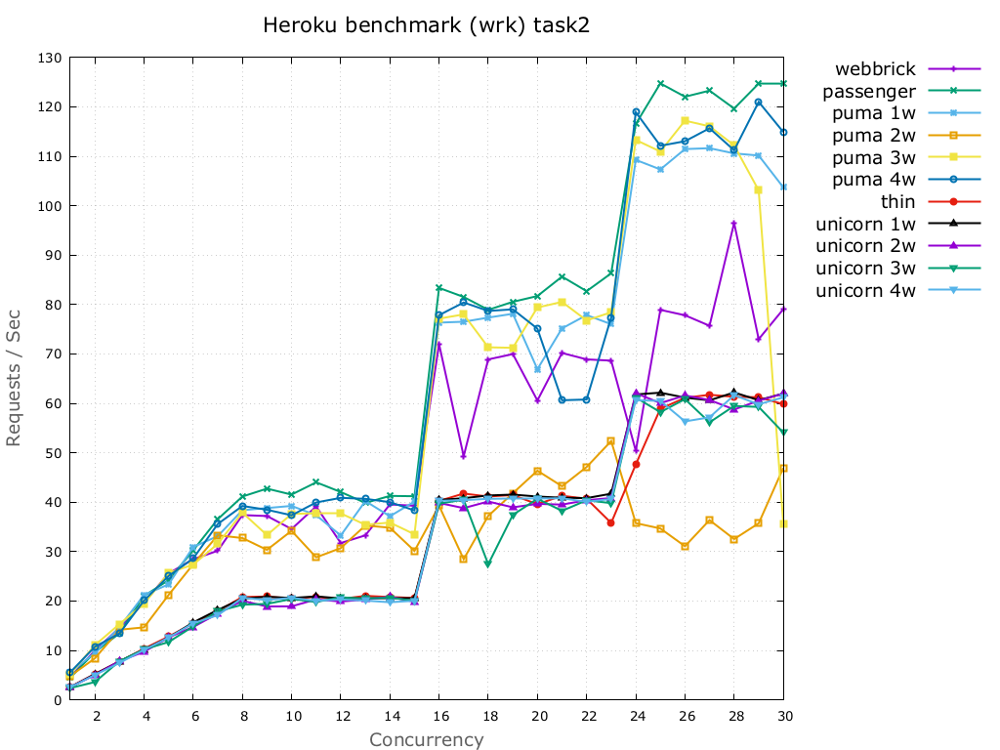
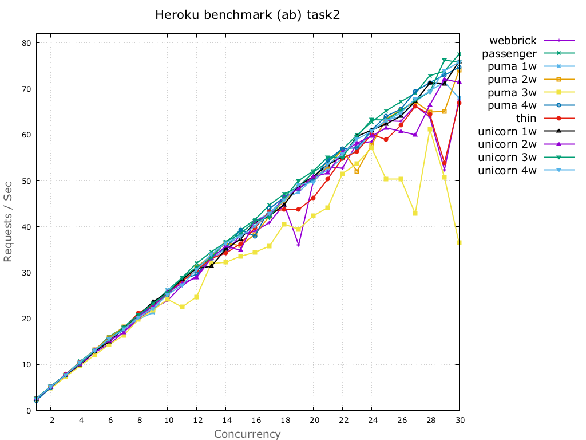

# Easy Lotto Benchmarks

**This is a spike project only. These results SHOULD NOT be considered as accurate**

## Running against Heroku

### benchmarks/task1

**Using `wrk` as benchmark tool**

|    conc.   |   master   |    thin    |    puma    |   puma-w2  |   puma-w3  |   puma-w4  |   unicorn  | unicorn-w2 | unicorn-w3 | unicorn-w4 |  passenger |
|------------|------------|------------|------------|------------|------------|------------|------------|------------|------------|------------|------------|
|      1     |    3.29    |    2.36    |    4.45    |    2.52    |    4.12    |    4.26    |    2.26    |    2.13    |    2.10    |    2.19    |    4.22    |
|      2     |    6.95    |    4.72    |    8.44    |    4.18    |    6.81    |    8.11    |    4.58    |    4.33    |    4.16    |    4.52    |    7.72    |
|      3     |    10.03   |    6.88    |    11.37   |    7.17    |    11.80   |    10.97   |    6.78    |    6.55    |    5.19    |    6.52    |    11.86   |
|      4     |    10.66   |    8.77    |    17.58   |    9.07    |    15.54   |    14.13   |    8.98    |    8.57    |    8.92    |    8.78    |    14.42   |
|      5     |    12.56   |    11.60   |    19.43   |    7.37    |    18.21   |    16.80   |    10.79   |    10.71   |    10.77   |    11.33   |    18.24   |
|      6     |    16.62   |    13.48   |    24.16   |    9.41    |    20.14   |    22.36   |    13.20   |    13.06   |    12.03   |    13.53   |    22.63   |
|      7     |    11.81   |    15.36   |    27.10   |    17.10   |    21.23   |    18.60   |    15.15   |    15.12   |    14.28   |    15.40   |    22.61   |
|      8     |    14.95   |    16.97   |    22.79   |    14.85   |    23.72   |    26.08   |    17.40   |    15.21   |    16.10   |    17.20   |    25.62   |
|      9     |    14.42   |    17.57   |    27.90   |    16.01   |    29.43   |    29.55   |    16.91   |    15.61   |    12.07   |    17.48   |    29.34   |
|     10     |    15.91   |    16.98   |    26.70   |    12.33   |    29.18   |    19.83   |    16.97   |    15.38   |    16.59   |    17.97   |    27.93   |
|     11     |    11.09   |    17.40   |    21.89   |    11.22   |    28.66   |    31.13   |    17.41   |    8.44    |    17.04   |    17.54   |    32.03   |
|     12     |    14.44   |    17.25   |    24.41   |    13.76   |    21.49   |    19.20   |    17.34   |    15.61   |    14.32   |    17.54   |    32.25   |
|     13     |    15.92   |    16.84   |    27.60   |    10.79   |    31.80   |    31.77   |    16.78   |    14.75   |    16.57   |    16.59   |    30.57   |
|     14     |    14.06   |    16.37   |    24.98   |    19.44   |    26.90   |    31.27   |    17.35   |    18.21   |    17.51   |    17.71   |    31.19   |
|     15     |    14.95   |    15.31   |    22.75   |    12.92   |    29.86   |    30.76   |    16.64   |    15.01   |    15.73   |    17.81   |    30.83   |
|     16     |    16.36   |    16.89   |    31.64   |    18.70   |    37.13   |    53.63   |    18.58   |    26.77   |    21.13   |    32.58   |    58.02   |
|     17     |    15.44   |    20.93   |    33.31   |    14.41   |    51.14   |    53.98   |    18.47   |    22.37   |    31.85   |    33.77   |    52.65   |
|     18     |    14.32   |    19.93   |    33.08   |    14.11   |    40.11   |    55.45   |    19.36   |    26.14   |    20.09   |    32.23   |    59.65   |
|     19     |    14.65   |    19.88   |    29.73   |    16.64   |    42.71   |    51.37   |    20.33   |    29.60   |    17.08   |    34.35   |    48.98   |
|     20     |    17.37   |    19.80   |    31.03   |    15.41   |    49.86   |    49.52   |    19.48   |    33.44   |    23.75   |    28.57   |    52.39   |
|     21     |    14.30   |    12.99   |    31.01   |    18.40   |    46.84   |    53.08   |    19.99   |    29.12   |    31.93   |    33.90   |    52.30   |
|     22     |    16.77   |    20.93   |    23.95   |    20.04   |    49.12   |    51.61   |    19.40   |    24.99   |    26.83   |    32.16   |    50.84   |
|     23     |    11.76   |    20.34   |    32.70   |    19.81   |    44.88   |    30.33   |    20.26   |    28.77   |    30.36   |    30.86   |    46.36   |
|     24     |    15.24   |    22.32   |    31.32   |    21.36   |    61.48   |    62.74   |    19.63   |    23.81   |    39.03   |    41.32   |    72.12   |
|     25     |    10.57   |    21.85   |    29.30   |    21.42   |    54.88   |    55.10   |    20.21   |    28.30   |    30.54   |    36.57   |    67.42   |
|     26     |    17.47   |    20.19   |    32.76   |    20.13   |    59.76   |    34.28   |    19.74   |    27.27   |    22.85   |    31.72   |    74.45   |
|     27     |    13.87   |    18.99   |    30.79   |    18.94   |    53.54   |    54.59   |    21.03   |    32.97   |    37.70   |    31.24   |    72.47   |
|     28     |    14.85   |    22.45   |    26.54   |    23.54   |    32.34   |    61.51   |    19.14   |    26.73   |    36.79   |    33.67   |    57.52   |
|     29     |    17.81   |    21.36   |    32.53   |    22.05   |    62.74   |    47.64   |    19.51   |    31.13   |    20.36   |    32.73   |    52.35   |
|     30     |    15.48   |    21.89   |    32.90   |    31.46   |    52.60   |    63.89   |    20.66   |    27.57   |    32.29   |    26.24   |    61.71   |

**Using `ab` as benchmark tool**

|    conc.   |   master   |    thin    |    puma    |   puma-w2  |   puma-w3  |   puma-w4  |   unicorn  | unicorn-w2 | unicorn-w3 | unicorn-w4 |  passenger |
|------------|------------|------------|------------|------------|------------|------------|------------|------------|------------|------------|------------|
|      1     |    2.17    |    2.11    |    2.18    |    2.37    |    1.71    |    1.95    |    2.25    |    2.19    |    2.29    |    2.33    |    2.31    |
|      2     |    4.51    |    4.37    |    4.57    |    4.63    |    3.27    |    4.55    |    4.46    |    4.04    |    4.63    |    4.48    |    4.74    |
|      3     |    6.65    |    6.78    |    6.83    |    6.87    |    4.81    |    6.46    |    6.83    |    6.93    |    7.18    |    6.90    |    7.08    |
|      4     |    8.69    |    9.00    |    8.53    |    9.35    |    6.51    |    9.09    |    8.89    |    8.16    |    9.18    |    9.01    |    9.34    |
|      5     |    10.14   |    10.70   |    11.00   |    11.70   |    7.74    |    10.69   |    10.91   |    11.48   |    11.55   |    11.14   |    11.61   |
|      6     |    9.10    |    11.04   |    12.33   |    13.64   |    9.75    |    12.90   |    12.95   |    12.12   |    13.43   |    13.80   |    13.97   |
|      7     |    10.07   |    14.61   |    14.80   |    16.01   |    10.42   |    15.03   |    13.92   |    12.40   |    15.91   |    15.83   |    16.19   |
|      8     |    8.62    |    16.23   |    17.12   |    18.46   |    12.75   |    15.24   |    15.42   |    17.12   |    18.26   |    18.41   |    18.30   |
|      9     |    11.83   |    16.72   |    16.98   |    20.09   |    13.63   |    19.36   |    17.06   |    17.92   |    20.22   |    20.39   |    20.63   |
|     10     |    12.31   |    18.01   |    20.60   |    21.91   |    15.11   |    21.42   |    16.83   |    20.75   |    22.69   |    20.61   |    22.59   |
|     11     |    12.70   |    18.55   |    23.58   |    23.75   |    12.77   |    22.64   |    16.92   |    22.93   |    24.84   |    23.38   |    25.03   |
|     12     |    10.39   |    19.29   |    23.39   |    25.73   |    13.82   |    24.42   |    16.81   |    23.40   |    26.77   |    22.81   |    27.45   |
|     13     |    12.51   |    18.39   |    25.23   |    26.05   |    17.66   |    27.15   |    17.03   |    27.20   |    29.86   |    26.17   |    30.29   |
|     14     |    15.32   |    16.94   |    26.61   |    29.30   |    15.79   |    30.92   |    17.47   |    23.83   |    31.17   |    32.03   |    31.28   |
|     15     |    16.52   |    17.00   |    27.72   |    28.83   |    16.14   |    32.09   |    14.66   |    32.25   |    34.29   |    32.81   |    34.31   |
|     16     |    16.36   |    14.49   |    29.90   |    26.86   |    18.35   |    35.62   |    16.48   |    30.40   |    35.30   |    35.07   |    36.15   |
|     17     |    18.45   |    14.33   |    30.06   |    24.98   |    19.07   |    37.18   |    16.24   |    20.09   |    38.20   |    36.73   |    36.57   |
|     18     |    16.13   |    17.69   |    30.42   |    25.80   |    19.54   |    36.25   |    15.32   |    27.21   |    40.05   |    34.62   |    41.21   |
|     19     |    9.68    |    16.09   |    31.79   |    33.52   |    22.57   |    40.10   |    17.10   |    27.41   |    40.50   |    36.12   |    40.66   |
|     20     |    9.32    |    16.48   |    32.53   |    40.52   |    23.81   |    40.71   |    16.93   |    33.71   |    41.85   |    34.49   |    39.37   |
|     21     |    10.53   |    12.22   |    31.16   |    43.23   |    21.95   |    40.08   |    15.13   |    29.79   |    43.50   |    43.51   |    41.24   |
|     22     |    18.68   |    17.42   |    30.39   |    34.14   |    27.88   |    47.94   |    16.57   |    27.31   |    48.50   |    39.66   |    40.68   |
|     23     |    19.89   |    17.69   |    31.65   |    40.77   |    29.88   |    43.98   |    16.68   |    28.11   |    46.32   |    41.71   |    49.22   |
|     24     |    17.77   |    18.28   |    28.51   |    46.78   |    27.51   |    45.97   |    16.49   |    25.82   |    46.86   |    43.14   |    53.03   |
|     25     |    18.06   |    15.57   |    29.74   |    45.05   |    32.78   |    46.32   |    16.30   |    21.11   |    47.45   |    33.29   |    51.11   |
|     26     |    17.28   |    17.79   |    30.12   |    45.85   |    28.75   |    45.39   |    16.35   |    19.66   |    50.81   |    27.50   |    56.93   |
|     27     |    15.68   |    18.37   |    30.23   |    41.33   |    26.14   |    52.96   |    17.10   |    21.10   |    45.93   |    35.96   |    57.75   |
|     28     |    14.19   |    16.49   |    30.87   |    39.36   |    23.31   |    56.72   |    14.66   |    19.41   |    51.34   |    35.28   |    59.45   |
|     29     |    12.84   |    15.66   |    34.93   |    32.52   |    27.32   |    57.44   |    16.74   |    19.04   |    47.90   |    26.02   |    53.95   |
|     30     |    8.45    |    17.87   |    28.33   |    37.02   |    27.25   |    60.09   |    16.28   |    21.12   |    48.05   |    36.13   |    63.36   |

### benchmarks/task2

**Using `wrk` as benchmark tool**

|    conc.   |   master   |    thin    |    puma    |   puma-w2  |   puma-w3  |   puma-w4  |   unicorn  | unicorn-w2 | unicorn-w3 | unicorn-w4 |  passenger |
|------------|------------|------------|------------|------------|------------|------------|------------|------------|------------|------------|------------|
|      1     |    4.59    |    2.63    |    5.55    |    4.85    |    5.26    |    5.59    |    2.60    |    2.57    |    2.40    |    2.56    |    4.52    |
|      2     |    9.98    |    5.25    |    9.53    |    8.41    |    11.07   |    10.75   |    5.22    |    5.06    |    3.62    |    5.06    |    9.67    |
|      3     |    14.59   |    7.77    |    14.71   |    14.20   |    15.34   |    13.45   |    7.80    |    7.85    |    7.84    |    7.47    |    13.47   |
|      4     |    19.68   |    10.37   |    21.24   |    14.68   |    19.44   |    20.11   |    10.20   |    9.74    |    10.23   |    10.13   |    21.04   |
|      5     |    25.60   |    12.83   |    23.39   |    21.24   |    25.71   |    25.08   |    12.59   |    12.66   |    11.72   |    12.62   |    24.25   |
|      6     |    28.47   |    15.51   |    30.95   |    27.46   |    27.38   |    28.62   |    15.69   |    14.76   |    14.88   |    15.52   |    30.26   |
|      7     |    30.19   |    17.97   |    33.15   |    33.31   |    31.59   |    35.60   |    18.21   |    17.47   |    17.93   |    17.14   |    36.58   |
|      8     |    37.40   |    20.82   |    38.39   |    32.75   |    37.90   |    39.25   |    20.49   |    20.06   |    19.27   |    20.66   |    41.15   |
|      9     |    37.21   |    20.92   |    38.82   |    30.36   |    33.35   |    38.48   |    20.87   |    18.90   |    19.43   |    20.22   |    42.75   |
|     10     |    34.58   |    20.50   |    39.26   |    34.22   |    37.63   |    37.36   |    20.62   |    18.93   |    20.42   |    20.66   |    41.55   |
|     11     |    39.16   |    20.83   |    37.38   |    28.85   |    37.86   |    39.96   |    20.95   |    20.34   |    19.83   |    20.06   |    44.03   |
|     12     |    31.75   |    20.42   |    33.27   |    30.72   |    37.86   |    40.89   |    20.53   |    19.91   |    20.76   |    20.33   |    42.07   |
|     13     |    33.30   |    21.06   |    40.23   |    35.29   |    35.44   |    40.69   |    20.59   |    20.30   |    20.49   |    20.10   |    39.86   |
|     14     |    39.55   |    20.82   |    37.16   |    34.85   |    35.90   |    40.02   |    20.59   |    20.89   |    20.69   |    19.76   |    41.28   |
|     15     |    39.29   |    20.63   |    40.15   |    30.16   |    33.51   |    38.34   |    20.59   |    19.84   |    20.06   |    20.07   |    41.21   |
|     16     |    72.00   |    40.27   |    76.35   |    39.29   |    77.16   |    77.86   |    40.46   |    39.86   |    39.72   |    40.29   |    83.37   |
|     17     |    49.30   |    41.76   |    76.53   |    28.47   |    78.01   |    80.42   |    40.82   |    38.81   |    40.50   |    40.42   |    81.54   |
|     18     |    68.91   |    41.15   |    77.37   |    37.24   |    71.35   |    78.71   |    41.37   |    40.15   |    27.45   |    40.69   |    78.94   |
|     19     |    69.98   |    41.46   |    78.14   |    41.82   |    71.25   |    79.04   |    41.55   |    38.97   |    37.44   |    40.75   |    80.56   |
|     20     |    60.59   |    39.59   |    66.92   |    46.38   |    79.41   |    75.12   |    41.15   |    39.67   |    40.70   |    40.77   |    81.72   |
|     21     |    70.20   |    41.31   |    75.18   |    43.23   |    80.54   |    60.64   |    40.91   |    39.52   |    38.26   |    40.80   |    85.66   |
|     22     |    68.91   |    40.70   |    77.87   |    47.13   |    76.79   |    60.79   |    40.84   |    40.41   |    40.39   |    40.09   |    82.71   |
|     23     |    68.65   |    35.81   |    76.03   |    52.39   |    78.44   |    77.40   |    41.73   |    40.85   |    39.82   |    40.66   |    86.32   |
|     24     |    50.39   |    47.64   |   109.27   |    35.77   |   113.31   |   118.92   |    61.81   |    62.07   |    61.18   |    60.65   |   116.54   |
|     25     |    78.93   |    58.92   |   107.34   |    34.69   |   110.96   |   112.14   |    62.17   |    60.05   |    58.23   |    60.50   |   124.75   |
|     26     |    77.83   |    61.12   |   111.46   |    31.09   |   117.21   |   113.05   |    61.17   |    61.61   |    60.86   |    56.36   |   122.06   |
|     27     |    75.71   |    61.74   |   111.64   |    36.38   |   116.07   |   115.67   |    60.62   |    60.69   |    56.16   |    57.18   |   123.29   |
|     28     |    96.51   |    61.34   |   110.58   |    32.55   |   112.21   |   111.22   |    62.22   |    58.77   |    59.48   |    61.66   |   119.66   |
|     29     |    73.00   |    61.24   |   110.16   |    35.74   |   103.10   |   121.02   |    60.65   |    60.55   |    59.28   |    59.82   |   124.72   |
|     30     |    79.07   |    59.86   |   103.72   |    46.94   |    35.68   |   114.91   |    61.99   |    62.00   |    54.10   |    61.22   |   124.70   |

**Using `ab` as benchmark tool**

|    conc.   |   master   |    thin    |    puma    |   puma-w2  |   puma-w3  |   puma-w4  |   unicorn  | unicorn-w2 | unicorn-w3 | unicorn-w4 |  passenger |
|------------|------------|------------|------------|------------|------------|------------|------------|------------|------------|------------|------------|
|      1     |    2.57    |    2.62    |    2.60    |    2.60    |    2.45    |    2.17    |    2.55    |    2.59    |    2.65    |    2.57    |    2.62    |
|      2     |    5.14    |    5.25    |    5.10    |    5.15    |    4.83    |    5.04    |    5.15    |    5.15    |    5.31    |    5.24    |    5.24    |
|      3     |    7.56    |    7.82    |    7.78    |    7.80    |    7.33    |    7.77    |    7.79    |    7.92    |    7.77    |    7.72    |    7.83    |
|      4     |    9.87    |    10.55   |    10.28   |    10.42   |    9.72    |    10.10   |    10.01   |    10.07   |    10.32   |    10.54   |    10.68   |
|      5     |    12.68   |    12.87   |    12.96   |    13.24   |    12.06   |    12.96   |    12.89   |    13.11   |    12.98   |    13.12   |    13.10   |
|      6     |    14.42   |    15.31   |    15.42   |    15.86   |    14.36   |    15.31   |    14.95   |    15.25   |    15.49   |    15.62   |    16.11   |
|      7     |    17.12   |    17.85   |    17.92   |    18.21   |    16.38   |    17.62   |    18.06   |    17.01   |    18.11   |    17.66   |    18.10   |
|      8     |    19.84   |    21.24   |    19.86   |    20.28   |    19.82   |    20.37   |    20.73   |    20.53   |    20.81   |    20.28   |    21.09   |
|      9     |    22.20   |    22.89   |    21.33   |    22.74   |    21.86   |    23.14   |    23.66   |    22.65   |    23.31   |    22.27   |    23.14   |
|     10     |    23.93   |    25.42   |    26.26   |    25.19   |    24.21   |    25.18   |    25.74   |    25.66   |    25.62   |    25.22   |    26.15   |
|     11     |    27.22   |    28.17   |    28.28   |    28.32   |    22.55   |    28.50   |    28.56   |    27.70   |    28.92   |    27.30   |    28.91   |
|     12     |    29.27   |    30.51   |    30.49   |    31.23   |    24.76   |    29.63   |    30.94   |    28.95   |    31.20   |    30.71   |    32.06   |
|     13     |    33.21   |    33.12   |    32.84   |    33.66   |    32.01   |    33.60   |    31.39   |    33.13   |    33.25   |    34.01   |    34.54   |
|     14     |    34.24   |    34.26   |    35.26   |    36.42   |    32.26   |    35.41   |    35.14   |    35.77   |    36.73   |    36.46   |    36.61   |
|     15     |    38.22   |    36.27   |    38.50   |    35.89   |    33.57   |    39.31   |    37.29   |    34.91   |    38.44   |    37.92   |    39.26   |
|     16     |    39.05   |    39.76   |    41.19   |    38.34   |    34.45   |    37.98   |    41.00   |    41.31   |    41.23   |    40.15   |    41.55   |
|     17     |    40.91   |    43.30   |    43.03   |    42.32   |    35.80   |    43.97   |    42.36   |    42.52   |    42.09   |    42.95   |    44.78   |
|     18     |    44.91   |    43.75   |    46.13   |    45.65   |    40.56   |    46.38   |    44.81   |    46.36   |    46.22   |    45.74   |    47.12   |
|     19     |    36.02   |    43.76   |    47.53   |    48.50   |    39.45   |    48.30   |    48.93   |    48.28   |    50.06   |    49.14   |    48.68   |
|     20     |    49.82   |    46.27   |    50.53   |    50.45   |    42.37   |    50.35   |    50.92   |    50.86   |    52.11   |    49.70   |    51.86   |
|     21     |    52.99   |    50.40   |    52.33   |    53.06   |    44.19   |    54.54   |    53.50   |    51.70   |    55.17   |    53.60   |    54.08   |
|     22     |    52.74   |    54.85   |    54.91   |    56.81   |    51.54   |    56.98   |    55.25   |    56.29   |    55.04   |    55.81   |    56.83   |
|     23     |    58.13   |    56.39   |    56.58   |    52.05   |    53.75   |    57.18   |    59.69   |    58.19   |    59.64   |    59.05   |    59.94   |
|     24     |    58.54   |    60.13   |    60.87   |    57.79   |    57.18   |    61.03   |    61.03   |    59.74   |    63.29   |    60.79   |    62.78   |
|     25     |    63.07   |    58.95   |    63.16   |    63.49   |    50.34   |    64.06   |    62.34   |    61.51   |    63.24   |    63.04   |    65.22   |
|     26     |    62.93   |    62.04   |    64.04   |    65.36   |    50.34   |    65.58   |    64.05   |    60.77   |    65.22   |    64.76   |    67.18   |
|     27     |    66.35   |    66.19   |    67.15   |    67.20   |    42.84   |    69.44   |    67.31   |    60.00   |    67.55   |    67.86   |    69.07   |
|     28     |    63.83   |    64.46   |    69.59   |    64.97   |    61.20   |    71.38   |    71.28   |    66.49   |    69.33   |    69.32   |    72.87   |
|     29     |    52.42   |    53.92   |    71.48   |    65.09   |    50.74   |    72.98   |    71.09   |    72.11   |    76.29   |    73.89   |    73.86   |
|     30     |    67.64   |    66.92   |    68.03   |    74.06   |    36.51   |    74.68   |    75.99   |    71.40   |    75.76   |    75.84   |    77.52   |

